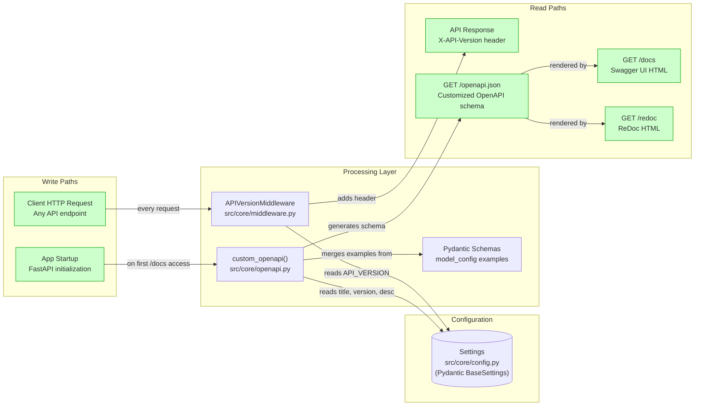
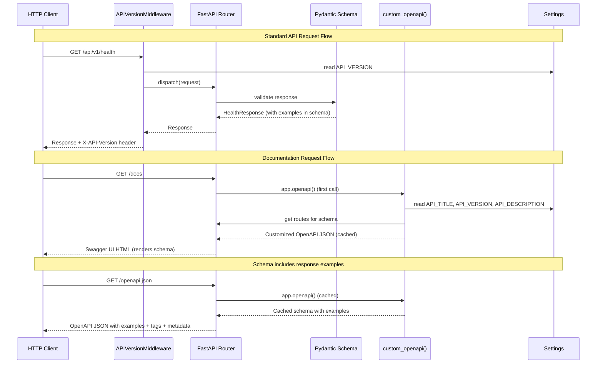
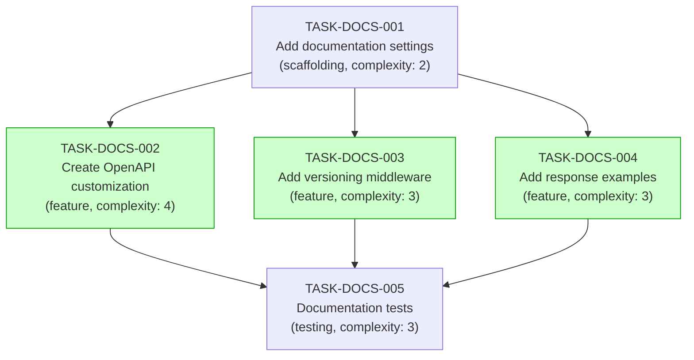

# Implementation Guide: API Documentation

**Feature**: Add comprehensive API documentation with Swagger UI, ReDoc, and OpenAPI schema customization
**Feature ID**: FEAT-DOCS
**Parent Review**: TASK-REV-AB87
**Approach**: Option 1 - Centralized OpenAPI Configuration Module
**Total Complexity**: 5/10
**Estimated Effort**: 5 tasks across 3 waves

---

## Data Flow: Read/Write Paths

This is the most important diagram - it shows every write and read path for this feature.



_All paths are connected. No disconnections detected. Settings flow from config to middleware and OpenAPI module. The OpenAPI JSON schema feeds both Swagger UI and ReDoc renderers._

---

## Integration Contracts



---

## Task Dependency Graph



_Tasks with green background (TASK-DOCS-002, TASK-DOCS-003, TASK-DOCS-004) can run in parallel in Wave 2._

---

## Execution Strategy

### Wave 1: Configuration Foundation (Sequential - must complete first)

| Task | Name | Mode | Complexity |
|------|------|------|-----------|
| TASK-DOCS-001 | Add documentation settings | direct | 2 |

Modifies: `src/core/config.py`, `.env.example`

### Wave 2: Feature Implementation (Parallel - no file conflicts)

| Task | Name | Mode | Complexity |
|------|------|------|-----------|
| TASK-DOCS-002 | Create OpenAPI schema customization | task-work | 4 |
| TASK-DOCS-003 | Add API versioning middleware | task-work | 3 |
| TASK-DOCS-004 | Add response examples to schemas | task-work | 3 |

- TASK-DOCS-002 creates: `src/core/openapi.py`, modifies `src/main.py`
- TASK-DOCS-003 creates: `src/core/middleware.py`, modifies `src/main.py`
- TASK-DOCS-004 creates: `src/core/schemas.py`, modifies `src/health/schemas.py`, `src/health/router.py`
- **Note**: TASK-DOCS-002 and TASK-DOCS-003 both modify `src/main.py` but touch different sections (OpenAPI config vs middleware registration). If using parallel execution, the last task to merge should resolve any conflicts in `src/main.py`.

### Wave 3: Testing (Sequential - depends on all Wave 2 tasks)

| Task | Name | Mode | Complexity |
|------|------|------|-----------|
| TASK-DOCS-005 | Add documentation and versioning tests | task-work | 3 |

Creates: `tests/core/test_openapi.py`, `tests/core/test_middleware.py`

---

## Architecture Notes

### Project Structure (After Implementation)

```
src/
├── core/
│   ├── config.py           # Extended with docs settings (TASK-DOCS-001)
│   ├── openapi.py          # Custom OpenAPI schema (TASK-DOCS-002)
│   ├── middleware.py        # API versioning middleware (TASK-DOCS-003)
│   └── schemas.py          # Shared error response schemas (TASK-DOCS-004)
├── health/
│   ├── router.py           # Updated with response examples (TASK-DOCS-004)
│   └── schemas.py          # Updated with model_config examples (TASK-DOCS-004)
└── main.py                 # Updated to wire OpenAPI + middleware (TASK-DOCS-002, 003)

tests/
└── core/
    ├── test_openapi.py     # OpenAPI schema + docs tests (TASK-DOCS-005)
    └── test_middleware.py   # Versioning header tests (TASK-DOCS-005)
```

### Key Design Decisions

1. **Centralized OpenAPI module** - Single `custom_openapi()` function in `src/core/openapi.py` for all schema customization. Uses FastAPI's native `get_openapi()` utility with caching.
2. **Settings-driven config** - All documentation values (title, version, URLs) configurable via environment variables through Pydantic BaseSettings.
3. **Middleware for versioning** - `X-API-Version` header applied globally via ASGI middleware, not per-route. Ensures consistency across all endpoints.
4. **Co-located examples** - Response examples defined in Pydantic `model_config` alongside the schema definition, not in separate files. Keeps examples in sync with schema changes.
5. **No external dependencies** - All features use FastAPI/Starlette built-in capabilities. Zero new packages required.

### Extension Points

When adding new features:
- Add tag metadata to `Settings.API_TAGS_METADATA` for new endpoint groups
- Follow the `model_config` + `json_schema_extra` pattern for response examples on new schemas
- Add `responses` parameter to routes for error documentation
- The versioning middleware automatically covers all new endpoints
