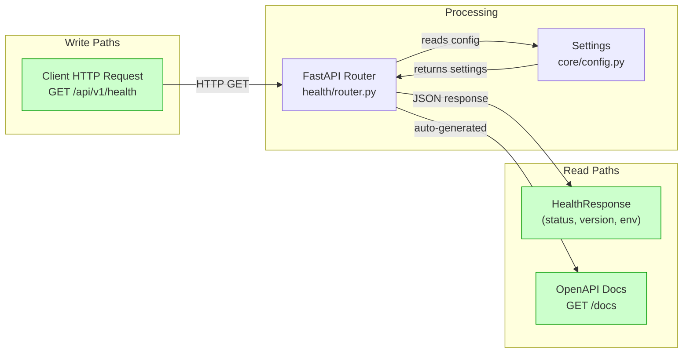
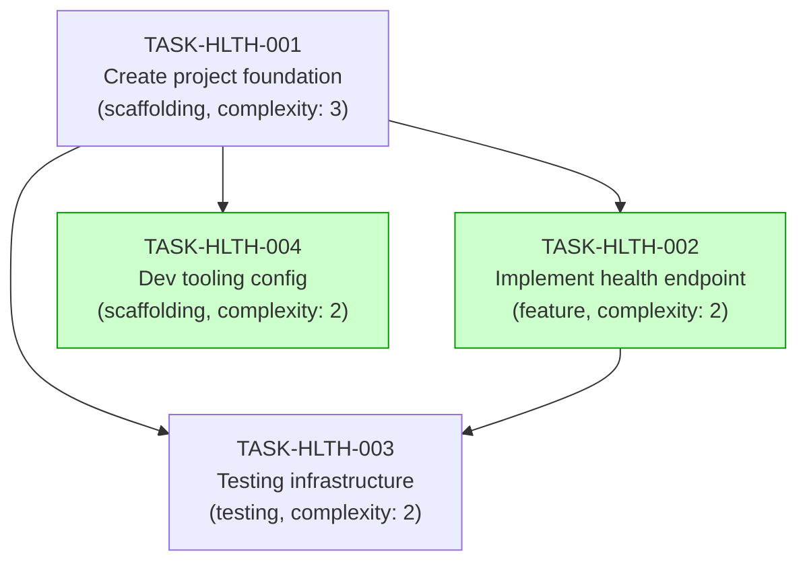

# Implementation Guide: FastAPI Health App

**Feature**: Create FastAPI app with health endpoint
**Feature ID**: FEAT-HLTH
**Parent Review**: TASK-REV-2214
**Approach**: Option 1 - Minimal FastAPI App (Health Only)
**Total Complexity**: 3/10
**Estimated Effort**: ~30 minutes

---

## Data Flow: Read/Write Paths

This is the most important diagram - it shows every write and read path for this feature.



_All paths are connected. No disconnections detected - the health endpoint is a simple request/response flow with no persistent storage._

---

## Task Dependency Graph



_Tasks with green background (TASK-HLTH-002, TASK-HLTH-004) can run in parallel in Wave 2._

---

## Execution Strategy

### Wave 1: Foundation (Sequential - must complete first)

| Task | Name | Mode | Complexity |
|------|------|------|-----------|
| TASK-HLTH-001 | Create project foundation | task-work | 3 |

Creates: `pyproject.toml`, `src/main.py`, `src/core/config.py`, `requirements/`

### Wave 2: Features + Tooling (Parallel - no file conflicts)

| Task | Name | Mode | Complexity |
|------|------|------|-----------|
| TASK-HLTH-002 | Implement health endpoint | task-work | 2 |
| TASK-HLTH-004 | Add dev tooling config | direct | 2 |

- TASK-HLTH-002 creates: `src/health/router.py`, `src/health/schemas.py`
- TASK-HLTH-004 creates: `.env.example`, `.gitignore`
- No file conflicts between these tasks

### Wave 3: Testing (Sequential - depends on Wave 1 + 2)

| Task | Name | Mode | Complexity |
|------|------|------|-----------|
| TASK-HLTH-003 | Testing infrastructure + tests | task-work | 2 |

Creates: `tests/conftest.py`, `tests/health/test_router.py`

---

## Architecture Notes

### Project Structure (After Implementation)

```
src/
├── __init__.py
├── main.py                 # FastAPI app entry point
├── core/
│   ├── __init__.py
│   └── config.py           # Pydantic BaseSettings
└── health/
    ├── __init__.py
    ├── router.py            # GET /health endpoint
    └── schemas.py           # HealthResponse model

tests/
├── __init__.py
├── conftest.py             # AsyncClient fixture
└── health/
    ├── __init__.py
    └── test_router.py      # Health endpoint tests

pyproject.toml              # Dependencies + tool config
requirements/
├── base.txt                # Production deps
└── dev.txt                 # Dev deps
.env.example                # Environment template
.gitignore                  # Git ignore patterns
```

### Key Design Decisions

1. **No database layer** - YAGNI. Will be added when the first data-driven feature is created.
2. **No auth** - Explicitly excluded per requirements. Health endpoint is public.
3. **Feature-based organization** - `src/health/` follows the pattern from CLAUDE.md for future feature modules.
4. **Pydantic BaseSettings** - Environment config via `.env` file, validated at startup.
5. **Async test client** - Uses `httpx.AsyncClient` with `ASGITransport` (modern pattern).

### Extension Points

When adding the next feature:
- Create `src/{feature}/` following the same pattern as `src/health/`
- Add database layer: `src/db/base.py`, `src/db/session.py`
- Add Alembic migrations when database is needed
- Auth can be added as `src/core/security.py` + `src/auth/` feature module
