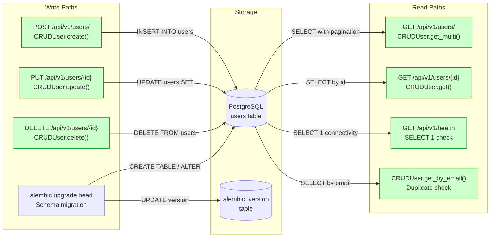
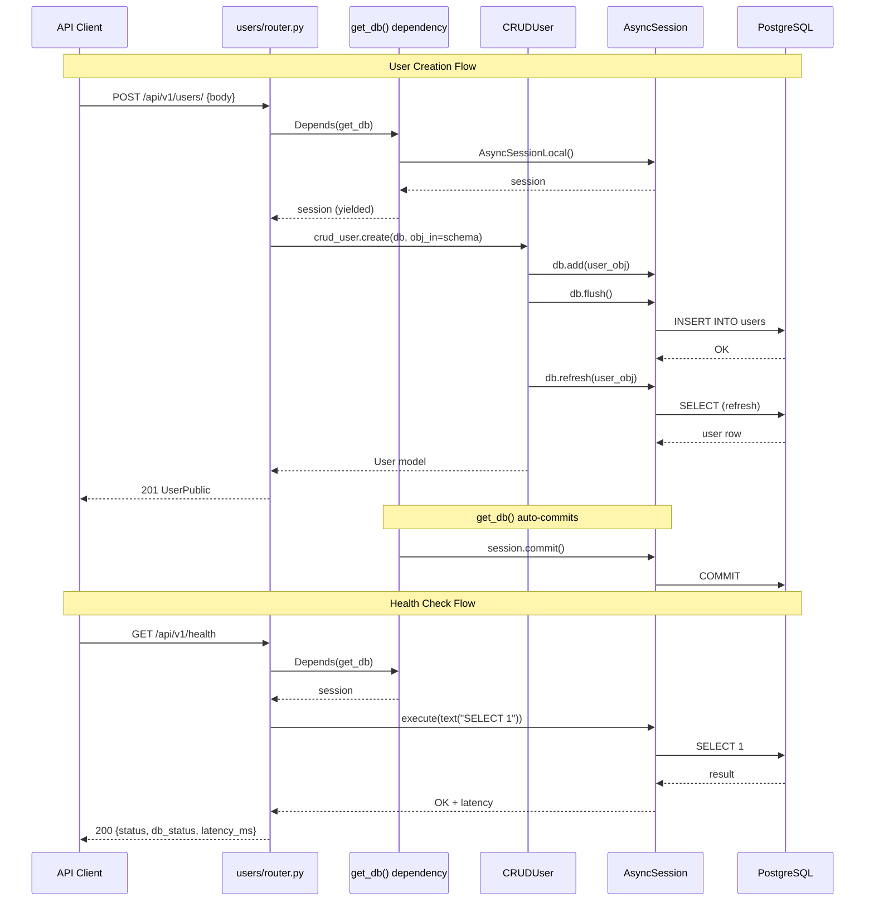
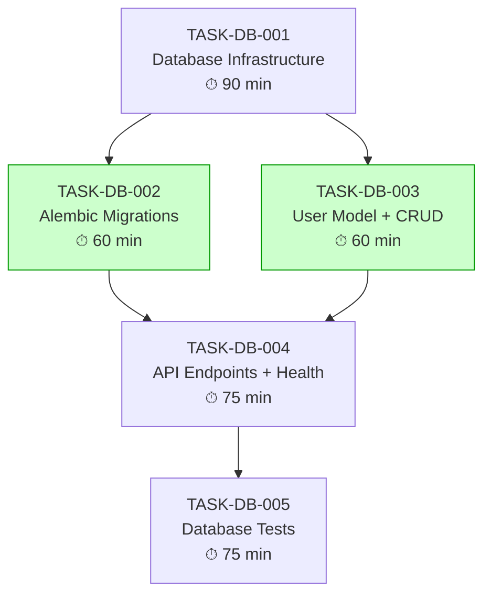

# Implementation Guide: PostgreSQL Database Integration

**Feature**: Add PostgreSQL database integration using SQLAlchemy async with connection pooling, health check integration, and a sample users table with CRUD endpoints
**Feature ID**: FEAT-A405
**Parent Review**: TASK-REV-A405
**Approach**: Template-Aligned Async Architecture (Option 1)
**Execution**: Sequential
**Testing**: Standard (80% coverage target)

---

## Data Flow: Read/Write Paths

This is the primary review artifact. It shows every write and read path for this feature.



_All write paths have corresponding read paths. No disconnections detected._

---

## Integration Contracts

Shows the sequence of calls between components for the two primary flows: user creation and health check.



_Data flows end-to-end from client through all layers to PostgreSQL and back. No "fetch then discard" patterns detected._

---

## Task Dependency Graph



_Tasks with green background could run in parallel (Wave 2), but sequential execution was selected._

---

## Execution Strategy

### Wave 1: Foundation
| Task | Description | Complexity | Duration |
|------|-------------|-----------|----------|
| TASK-DB-001 | Database infrastructure (engine, session, config, Docker) | 6/10 | 90 min |

### Wave 2: Schema & Data Layer
| Task | Description | Complexity | Duration |
|------|-------------|-----------|----------|
| TASK-DB-002 | Alembic migration setup + users table migration | 5/10 | 60 min |
| TASK-DB-003 | User model, Pydantic schemas, generic CRUD base | 5/10 | 60 min |

> **Note**: Tasks 2 and 3 only depend on Task 1 and could theoretically run in parallel, but sequential execution was chosen for simplicity.

### Wave 3: API Layer
| Task | Description | Complexity | Duration |
|------|-------------|-----------|----------|
| TASK-DB-004 | Users CRUD endpoints + health check DB integration | 6/10 | 75 min |

### Wave 4: Testing
| Task | Description | Complexity | Duration |
|------|-------------|-----------|----------|
| TASK-DB-005 | Async test fixtures, CRUD tests, API tests, schema tests | 5/10 | 75 min |

**Total Estimated Duration**: ~6 hours (360 minutes)

---

## Architecture Decisions

### 1. Auto-Commit Session Pattern
CRUD methods use `flush()` not `commit()`. The `get_db()` dependency handles commit on success and rollback on exception. This enables atomic multi-operation transactions within a single request.

### 2. Generic CRUD Base Class
`CRUDBase[ModelType, CreateSchemaType, UpdateSchemaType]` provides reusable CRUD operations. Feature-specific CRUD classes (e.g., `CRUDUser`) extend it with custom queries.

### 3. Connection Pooling
SQLAlchemy's built-in pool with `pool_size=10`, `max_overflow=20`, `pool_pre_ping=True`. No external pooler (PgBouncer) needed at this scale.

### 4. Health Check Graceful Degradation
The health endpoint reports DB status but does NOT return 500 when DB is down. It returns 200 with `db_status: "disconnected"` so load balancers can make informed decisions.

### 5. Docker Compose for Local Dev
PostgreSQL 16 Alpine via Docker Compose for zero-config local development. Named volume ensures data persistence across restarts.

### 6. Separate Test Database
Tests use a separate database (or SQLite async for CI) with per-test rollback to ensure isolation.

---

## File Impact Summary

### New Files (15)
| File | Layer | Task |
|------|-------|------|
| `src/db/__init__.py` | Infrastructure | TASK-DB-001 |
| `src/db/base.py` | Infrastructure | TASK-DB-001 |
| `src/db/session.py` | Infrastructure | TASK-DB-001 |
| `docker-compose.yml` | DevOps | TASK-DB-001 |
| `.env.example` | Config | TASK-DB-001 |
| `alembic.ini` | Migrations | TASK-DB-002 |
| `alembic/env.py` | Migrations | TASK-DB-002 |
| `alembic/script.py.mako` | Migrations | TASK-DB-002 |
| `src/users/__init__.py` | Feature | TASK-DB-003 |
| `src/users/models.py` | Feature | TASK-DB-003 |
| `src/users/schemas.py` | Feature | TASK-DB-003 |
| `src/crud/__init__.py` | Feature | TASK-DB-003 |
| `src/crud/base.py` | Feature | TASK-DB-003 |
| `src/users/crud.py` | Feature | TASK-DB-003 |
| `src/users/router.py` | API | TASK-DB-004 |

### Modified Files (4)
| File | Change | Task |
|------|--------|------|
| `src/core/config.py` | Add DATABASE_URL setting | TASK-DB-001 |
| `pyproject.toml` | Add database dependencies | TASK-DB-001 |
| `src/main.py` | Add lifespan handler, register router | TASK-DB-004 |
| `src/health/router.py` | Add DB health check | TASK-DB-004 |

### Test Files (4)
| File | Task |
|------|------|
| `tests/conftest.py` | TASK-DB-005 |
| `tests/users/test_crud.py` | TASK-DB-005 |
| `tests/users/test_router.py` | TASK-DB-005 |
| `tests/users/test_schemas.py` | TASK-DB-005 |

---

## Prerequisites

1. **Docker Desktop** installed and running (for PostgreSQL)
2. **FEAT-F97F** (health endpoint) should be implemented first, OR Task 1 will incorporate the project foundation
3. Python 3.11+ with pip/uv package manager

## Getting Started

```bash
# 1. Start PostgreSQL
docker compose up -d db

# 2. Copy environment config
cp .env.example .env

# 3. Install dependencies
pip install -e ".[dev]"

# 4. Run migrations
alembic upgrade head

# 5. Start the application
uvicorn src.main:app --reload

# 6. Test endpoints
open http://localhost:8000/docs
```
