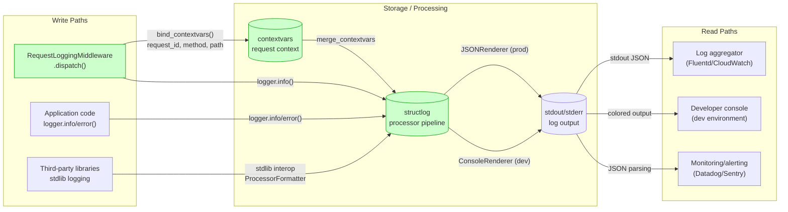
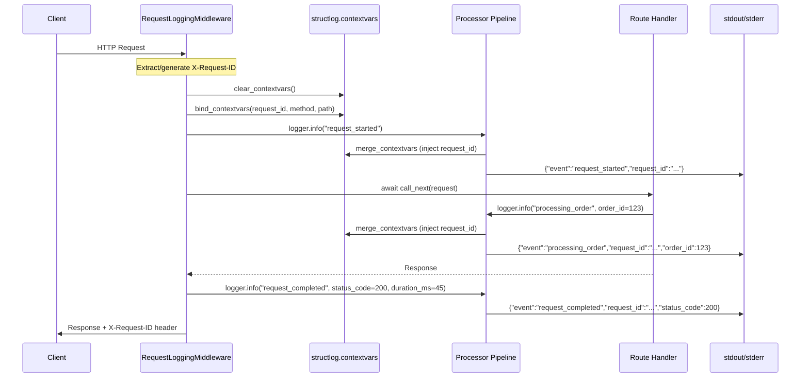
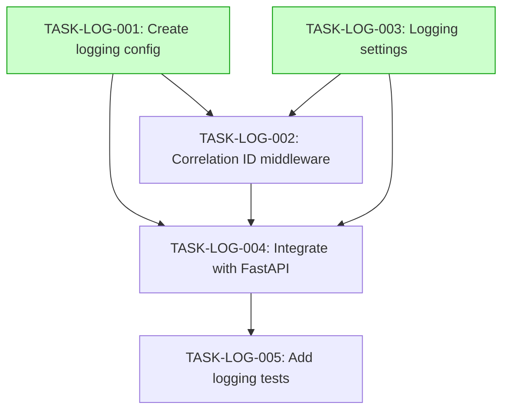

# Implementation Guide: Structured JSON Logging

**Feature**: FEAT-LOG
**Approach**: structlog with FastAPI middleware
**Testing**: Standard (quality gates)

## Data Flow: Read/Write Paths

This is the primary review artefact. It shows how log data flows through the system.



_All write paths connect to read paths via stdout/stderr. No disconnections detected._

## Integration Contracts



_Data flows from middleware through contextvars to pipeline to stdout at every stage. No fetch-then-discard patterns detected._

## Task Dependencies



_Tasks with green background (LOG-001, LOG-003) can run in parallel in Wave 1._

## Execution Waves

### Wave 1: Foundation (parallel)

| Task | Description | Mode | Complexity |
|---|---|---|---|
| TASK-LOG-001 | Create logging configuration module (`src/core/logging.py`) | task-work | 4 |
| TASK-LOG-003 | Create logging settings configuration (`src/core/config.py`) | direct | 3 |

**Why parallel**: These tasks create separate files (`logging.py` vs `config.py`) with no shared dependencies. LOG-001 defines the structlog pipeline; LOG-003 defines the Pydantic settings. They can be developed independently and connected in Wave 2.

### Wave 2: Core Implementation (parallel)

| Task | Description | Mode | Complexity |
|---|---|---|---|
| TASK-LOG-002 | Create correlation ID middleware (`src/core/middleware.py`) | task-work | 5 |
| TASK-LOG-004 | Integrate logging with FastAPI app (`src/main.py`) | direct | 3 |

**Why parallel**: LOG-002 creates the middleware class; LOG-004 wires everything into main.py. While LOG-004 depends on LOG-002 conceptually, they write to different files. LOG-004 can stub the middleware import and finalize after LOG-002 completes.

**Note**: LOG-004 has dependencies on all Wave 1 tasks AND LOG-002. In strict dependency mode, LOG-004 should run after LOG-002. In practice, both tasks in Wave 2 can start together since LOG-004 primarily wires imports.

### Wave 3: Verification

| Task | Description | Mode | Complexity |
|---|---|---|---|
| TASK-LOG-005 | Add logging tests | task-work | 4 |

**Why sequential**: Tests require all implementation to be complete to verify integration behavior, correlation ID propagation, and environment switching.

## Architecture Notes

### structlog Processor Pipeline

```
Log call → merge_contextvars → filter_by_level → add_logger_name
         → add_log_level → TimeStamper → StackInfoRenderer
         → format_exc_info → UnicodeDecoder → Renderer
                                                ├─ JSONRenderer (prod)
                                                └─ ConsoleRenderer (dev)
```

### Correlation ID Flow

1. **Request arrives** → Middleware extracts `X-Request-ID` or generates UUID4
2. **Context bound** → `bind_contextvars(request_id=...)` stores in async-safe ContextVar
3. **Any log call** → `merge_contextvars` processor injects `request_id` into event dict
4. **Response sent** → `X-Request-ID` header added to response
5. **Context cleared** → `clear_contextvars()` prevents leakage to next request

### Environment Configuration

| Environment | LOG_LEVEL | LOG_FORMAT | Renderer |
|---|---|---|---|
| development | DEBUG | console | `structlog.dev.ConsoleRenderer()` |
| staging | INFO | json | `structlog.processors.JSONRenderer()` |
| production | WARNING | json | `structlog.processors.JSONRenderer()` |

### Key Design Decisions

1. **stdout/stderr only** - No file handlers. Container-friendly, works with Docker log drivers and K8s log aggregation.
2. **structlog wrapping stdlib** - Third-party library logs (uvicorn, sqlalchemy) routed through structlog processors for consistent format.
3. **contextvars over thread-local** - Native async safety, correct propagation across `await` and `asyncio.create_task()`.
4. **Middleware-level logging** - Consistent request/response logging without polluting route handlers.
5. **Configurable exclude paths** - Health check endpoints produce minimal logs to reduce noise.

### Example Log Output

**Production (JSON)**:
```json
{
  "event": "request_completed",
  "request_id": "a1b2c3d4-e5f6-7890-abcd-ef1234567890",
  "method": "POST",
  "path": "/api/v1/users",
  "status_code": 201,
  "duration_ms": 45.2,
  "level": "info",
  "timestamp": "2026-02-16T10:30:00.000000Z",
  "logger": "app.middleware"
}
```

**Development (Console)**:
```
2026-02-16 10:30:00 [info     ] request_completed    request_id=a1b2c3d4 method=POST path=/api/v1/users status_code=201 duration_ms=45.2
```
